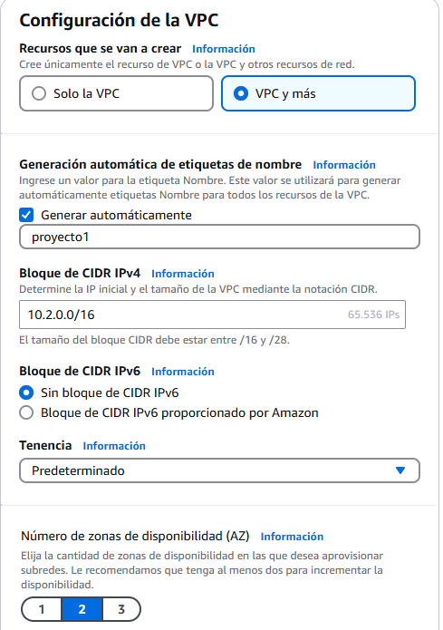
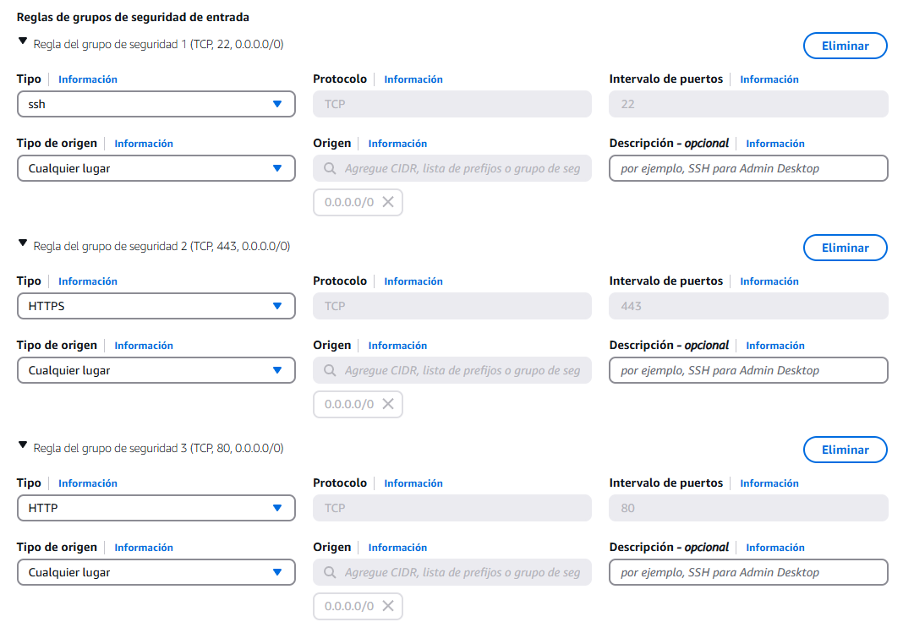
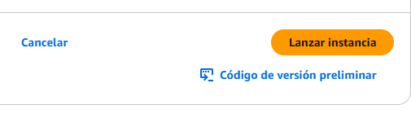

# Práctica: Instalación de WordPress en AWS con EFS y RDS

## Introducción
Esta práctica tiene como objetivo desplegar un sitio WordPress en AWS utilizando una instancia EC2 con almacenamiento compartido mediante EFS y una base de datos gestionada con RDS.

## 1. Creación de la infraestructura en AWS

### 1.1 Configuración de la VPC
1. Accede a la consola de AWS y dirígete al servicio de VPC. <br>
   <br>
2. Crea una nueva VPC con un rango de direcciones IP adecuado.<br>
      <br>
4. Define al menos una subred pública y otra privada.<br>
      <br>
5. Asocia una gateway de internet para permitir la conexión a la subred pública.<br>
      <br>
6. Crea la VPC<br>
      <br>

### 1.2 Lanzamiento de una instancia EC2
1. En la consola de AWS, accede al servicio EC2 y lanza una nueva instancia.
      <br>
2. Selecciona Ubuntu como sistema operativo.
      <br>
3. Configura un grupo de seguridad permitiendo tráfico HTTP (puerto 80) y SSH (puerto 22).
      <br>
4. Asocia la VPC.
      <br>
5. Lanzaremos la instancia.
      <br>

### 1.3 Creación de una base de datos RDS
1. Accede al servicio RDS y crea una nueva base de datos MySQL o MariaDB.
      <br>
      <br>
3. Configura los parámetros como usuario, contraseña y nombre de base de datos.
      <br>
4. Asegúrate de que el grupo de seguridad permite la conexión desde la instancia EC2.
      <br>
5. Configura la clase de instancia de base de datos y el almacenamiento.
      <br>
6. Una vez hayamos configurado todo, la crearemos.
      <br>

### 1.4 Configuración de la conexión de EC2 con RDS
1. Seleccionamos la base de datos y pulsaremos sobre "Acciones -> Configurar la conexión de EC2"
      
2. Seleccionaremos la instancia de EC2:
      
3. Confirmaremos los cambios:
      

### 1.5 Configuración de EFS
1. Accede al servicio EFS y crea un nuevo sistema de archivos.
      
2. Configura los puntos de montaje en las subredes correspondientes.
      
      
   
4. Conecta la instancia EC2 con EFS para el almacenamiento de `wp-content`.

## 2. Instalación y configuración de WordPress

### 2.1 Instalación de dependencias
Conéctate a la instancia EC2 y ejecuta los siguientes comandos:

```bash
sudo apt update && sudo apt upgrade -y
sudo apt install apache2 php php-mysql mysql-client -y
```
  
  

### 2.2 Descarga e instalación de WordPress
1. Descargamos el archivo.
      
2. Descomprimimos el archivo.
      

### 2.3 Configuración de la base de datos en WordPress
1. Nos conectamos al gestor de base de datos MYSQL:
      
2. Creamos la base de datos para WordPress:
      
3. Nos intentamos conectar a la WordPress desde el navegador:
      
4. Copiamos el contenido de wp-config-sample.php a wp-config.php:
      
5. Modificamos el archivo de wp-config.php:
      
6. Instalamos las dependencias de nfs:
      
7. Instalamos wordpress:
      
8. Y por último ya accederiamos a WordPress
      

## Conclusión
Con esta configuración, WordPress se ejecuta en una arquitectura escalable con almacenamiento compartido y una base de datos gestionada, mejorando la disponibilidad y redundancia del sistema.
