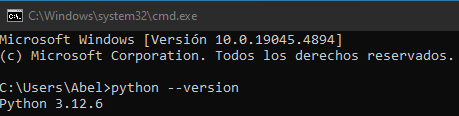
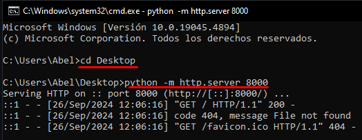
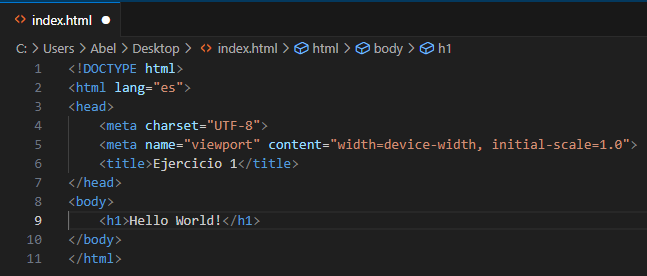

# Práctica servidor web

## 1. Simple web server.

Lo primero que tenemos que comprobar es si tenemos Python instalado, para ello abriremos CMD e introduciremos el siguiente comando

### Iniciar el servidor HTTP

Seguiremos en el CMD e introduciremos los siguientes comandos:

**Explicación de los comandos**

Comando 1: Nos moveremos a la carpeta escritorio.
Comando 2: Iniciaremos el servicio del servidor HTTP.

### Creación de archivo index.html

Nos moveremos a la carpeta donde hemos iniciado el servidor, es mi caso "Desktop".
Crearemos un archivo con extensión .html

### Descargar favicon

Buscaremos en el navegador una imagen para que aparezca en la pestaña del navegador.

