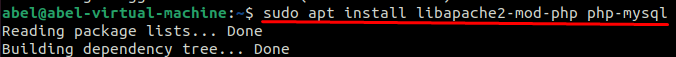
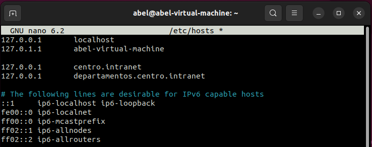

# 🖥️ Práctica Servidores Web (Primer Trimestre)

---

## 🎯 Objetivo
Instalar y configurar un servidor web interno para un instituto.

---

## 📋 Requisitos

### 1. Instalación del servidor web Apache
- Configurar dos dominios mediante el archivo `/etc/hosts`: 
  - `centro.intranet` (para servir contenido mediante WordPress).
  - `departamentos.centro.intranet` (para una aplicación en Python).

#### Instalación de Apache

 
#### Instalación de MySQL

 
#### Instalación de PhP

 

#### Modificación del fichero hosts
Usaremos el comando `nano /etc/hosts`

