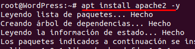
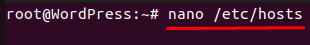
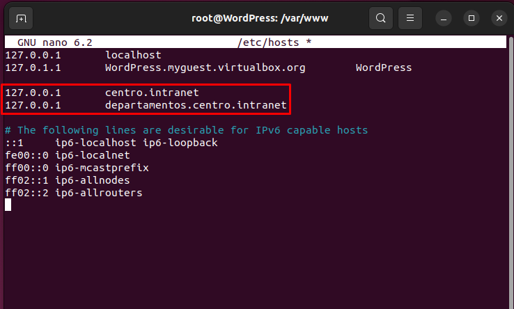
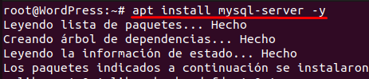
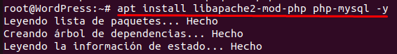

# 👨‍💻 Práctica Servidores Web (Primer Trimestre)👨‍💻

## 📋 Requisitos

### 1. Instalación del servidor web Apache
- Configurar dos dominios mediante el archivo `/etc/hosts`: 
  - `centro.intranet` (para servir contenido mediante WordPress).
  - `departamentos.centro.intranet` (para una aplicación en Python).

#### Instalación de Apache

---

### 2. Configuración de MySQL y PHP.
#### Cambiar la configuración del fichero /etc/hosts:

#### Instalación de MySQL:

#### Instalación de PHP:

