# 👨‍💻 Práctica Servidores Web (Primer Trimestre)👨‍💻

## üìã Requisitos

### 1. Instalación del servidor web Apache
- Configurar dos dominios mediante el archivo `/etc/hosts`: 
  - `centro.intranet` (para servir contenido mediante WordPress).
  - `departamentos.centro.intranet` (para una aplicación en Python).

#### Instalación de Apache

---

### 2. Configuración de MySQL y PHP.
#### Cambiar la configuración del fichero /etc/hosts:

#### Instalación de MySQL:

#### Instalación de PHP:

### 3. Instalación y Configuración de WordPress
#### Instalación de WordPress:
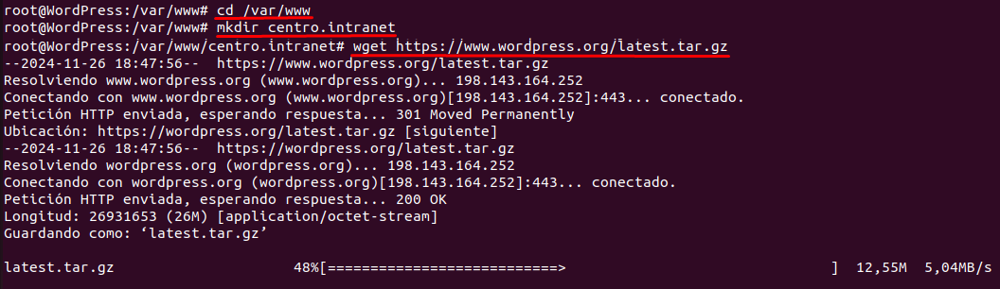

#### Descomprimimos la carpeta:
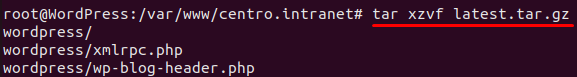

#### Eliminamos la carpeta de WordPress:
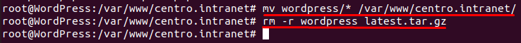

#### Configuración del VirtualHosts:
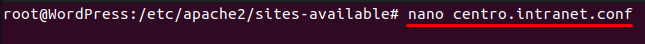
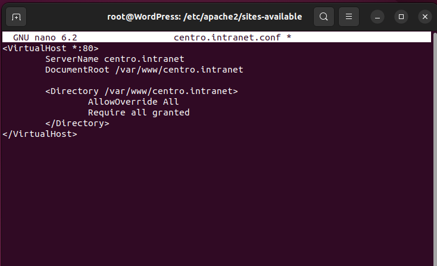

#### Habilitamos el sitio y reiniciamos apache para aplicar los cambios:
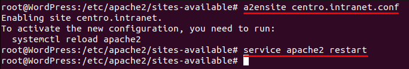

#### Accedemos a `centro.intranet`
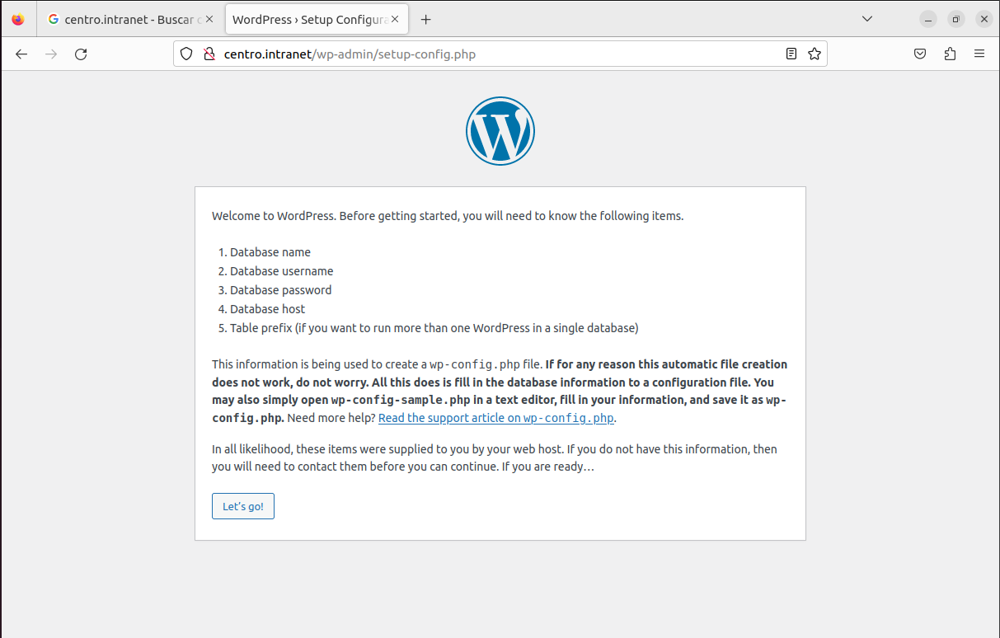

#### Accedemos a MySQL creamos la base de datos
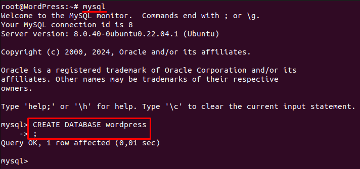

#### Creamos el usuario "admin"
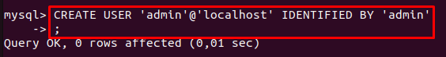

#### Damos permisos al usuario:
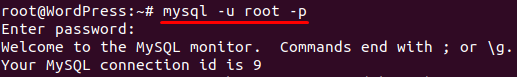

#### Una vez creada la base de datos, podemos continuar con WordPress:
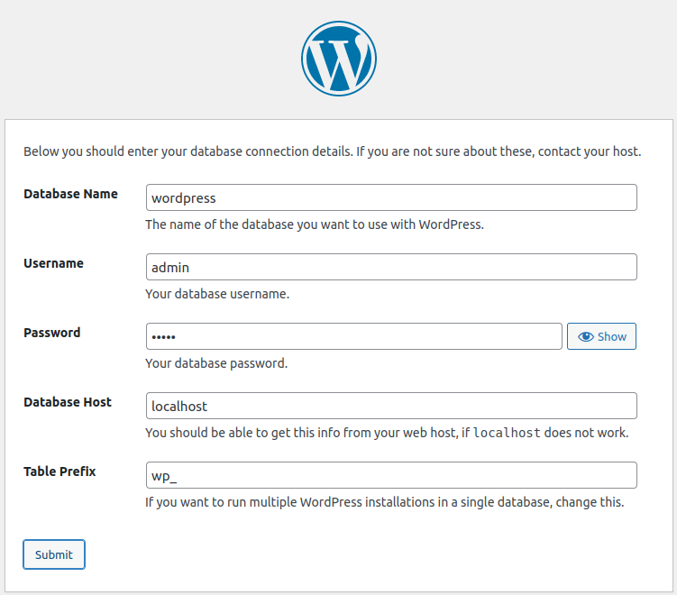

#### Copiamos el archivo `wp-config-sample.php` yy le ponemos de nombre `wp-config.php` y rellenamos los siguientes datos:
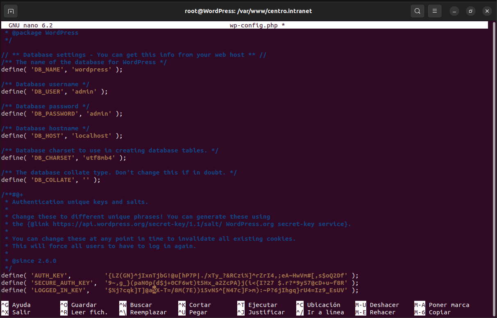

####Ya podemos seguir con la instalación
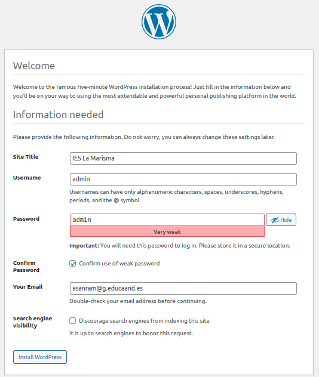

#### Tras el anterior paso, ya hemos instalado y configurado WordPress:

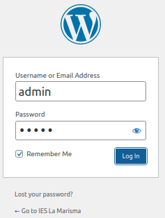

---

### 4. Instalación y activación del módulo WGSI
#### Creamos el directorio en /var/www y habilitamos el módulo wsgi:
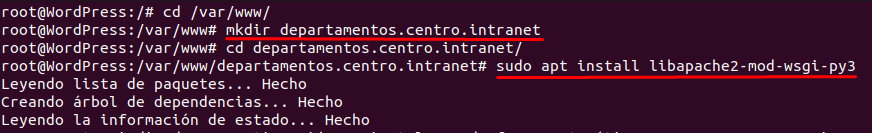

#### Activamos el módulo:
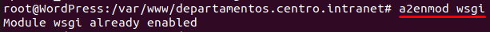

#### Configuramos el archivo `departamentos.centro.intranet`
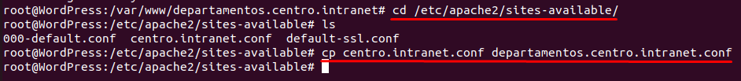
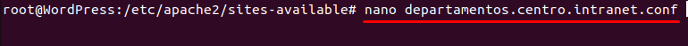

#### Habilitamos el sitio
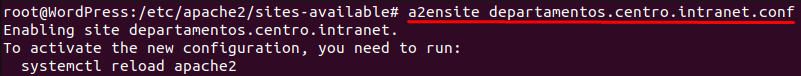

#### Creamos el archivo que ser√° el index:
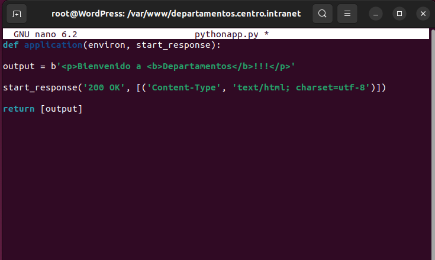

### 5. Despliegue de una Aplicación Python

#### Reiniciamos apache con `systemctl restart apache2` y accedemos al sitio web:
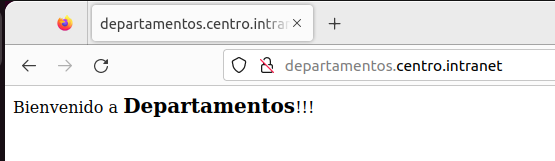

####Uso de contraseñas
####Crearemos un archivo para guardar los usuarios y contraseñas en un sitio que sea accesible:
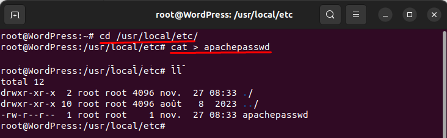

#### Creamos los usuarios y contraseñas los cuales se autenticarán:
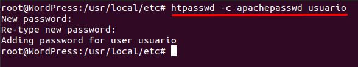

#### Configuramos el virtualhost de departamentos.centro.intranet:
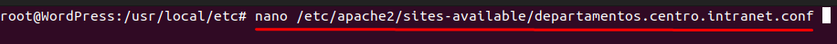
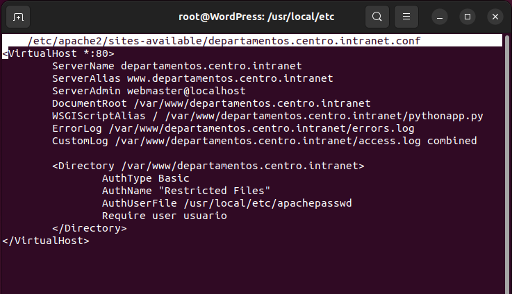

#### Activamos el módulo `auth_basic` y reiniciamos apache:
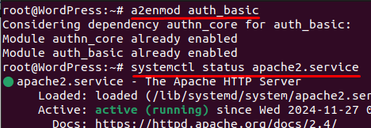

#### Accedemos a departamentos.centro.intranet y nos pedir√° el usuario:
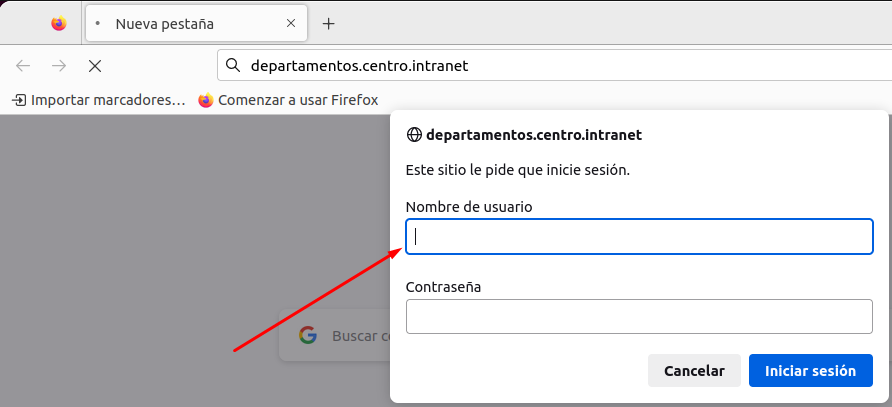

### 6. Instalación y configuración de Awstat.
#### Instalamos Awstats:
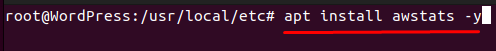

#### Activamos el módulo cgi:
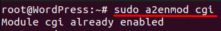

#### Reiniciamos apache:
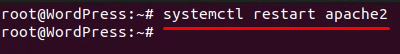

#### Configuramos el archivo de Awstats:
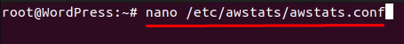
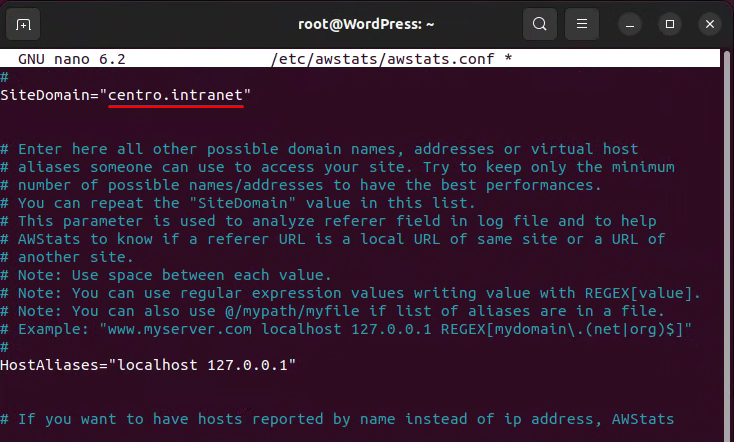
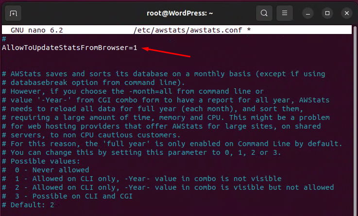

Generamos las estadísticas iniciales:
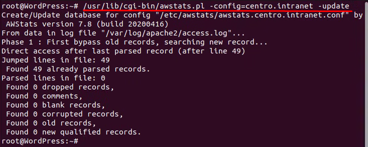

#### Configuramos Apache para awstats:

#### Modificaremos la configuración de awstats en Apache:
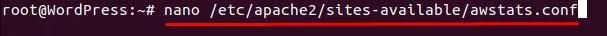
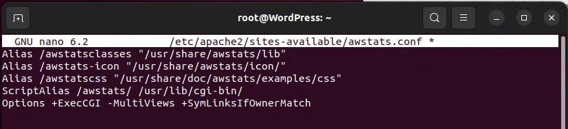

#### Habilitamos la configuración y reiniciamos Apache:
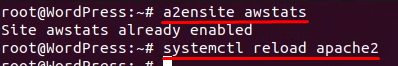

#### Accedemos al sitio web podemos ver las estadísticas de visita de nuestro dominio.
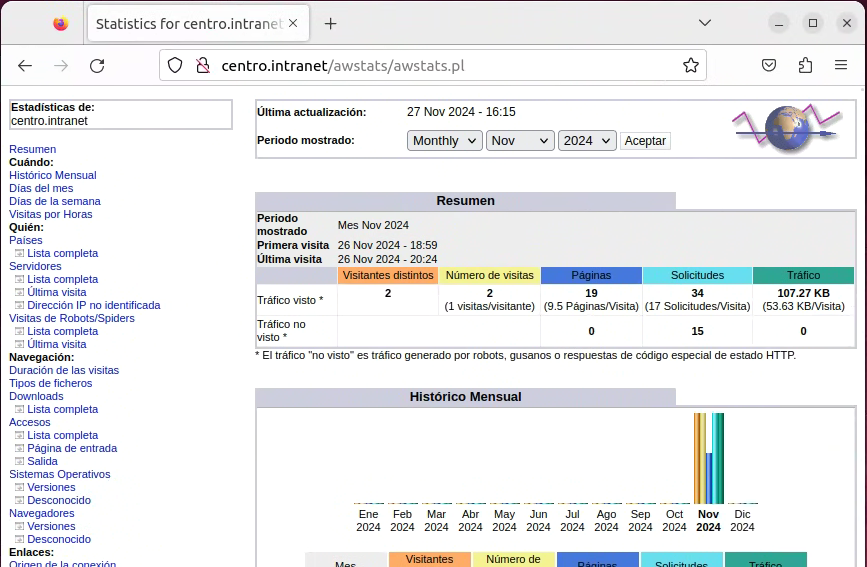

### 7. Instalación del servidor web nginx.
#### Intalamos Nginx:
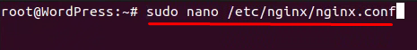

