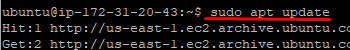
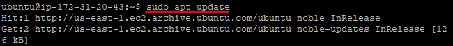
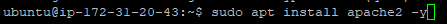
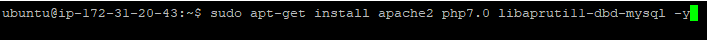
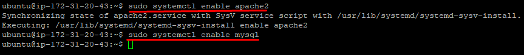
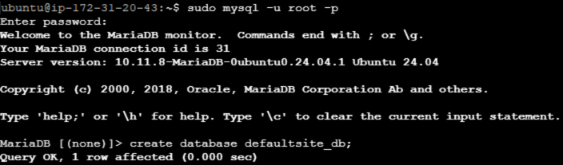
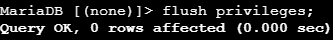
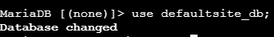
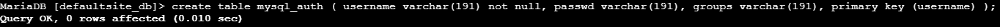
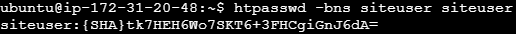

# Instalación del servidor web Apache

#### Primero actualizamos la lista de paquetes disponibles en los repositorios configurados en el sistema:
`sudo apt update` y `sudo apt upgrade`

  

#### Instalamos Apache:
`sudo apt-get install apache2` 

#### instalamos PHP, MySQL y MariaDB:
`sudo apt-get install apache2 php7.0 libapruti11-dbd-mysql -y` 

`sudo apt-get install mariadb-server mariadb-client -y` 

#### Activamos los servicios:
`sudo systemctl enable apache2`
`sudo systemctl enable mysql` 

#### Entramos en MySQL y creamos una base de datos nueva:
`sudo mysql -u root -p`  

#### Damos permisos totales a la base de datos:
`GRANT SELECT, INSERT, UPDATE, DELETE ON defaultsite_db.* TO 'defaultsite_admin'@'localhost' IDENTIFIED BY 'usuario';`  
`GRANT SELECT, INSERT, UPDATE, DELETE ON defaultsite_db.* TO 'defaultsite_admin'@'localhost.localdomain' IDENTIFIED BY 'password';`  

`flush privileges;`  

#### Entramos en la base de datos:
`use defaultsite_db;`  

#### Y creamos una tabla para los usuarios autenticados:
`CREATE table mysql_auth ( username varchar(191) not null, passwd varchar(191), groups varchar(191), primary key (username) );`
  
Transformamos una contraseña a hash para hacerlo más seguro:
`htpasswd -bns siteuser siteuser`  

#### Insertamos los datos en la tabla que hemos creado en la base de datos.
`INSERT INTO `mysql_auth` (`username`, `passwd`, `groups`) VALUES('siteuser', '{SHA}tk7HEH6Wo7SKT6+3FHCgiGnJ6dA=', 'sitegroup');`  

#### Habilitamos los módulos.
`sudo a2enmod dbd`  
`sudo a2enmod authn_dbd`  
`sudo a2enmod socache_shmcb`  
`sudo a2enmod authn_socache`

#### Creamos el directorio que estará protegido.

`sudo mkdir /var/www/html/protecteddir`  
`sudo chown -R www-data:www-data /var/www/html/protecteddir`

#### Modificamos la configuración de Apache de nuestro dominio:
`sudo nano /etc/apache2/sites-available/000-default.conf`

#### Introducimos lo siguiente:

#### Y reiniciamos Apache.
`sudo systemctl restart apache2`

#### Ahora cuando entremos al directorio por acceso web, nos pedirá el usuario y contraseña.

