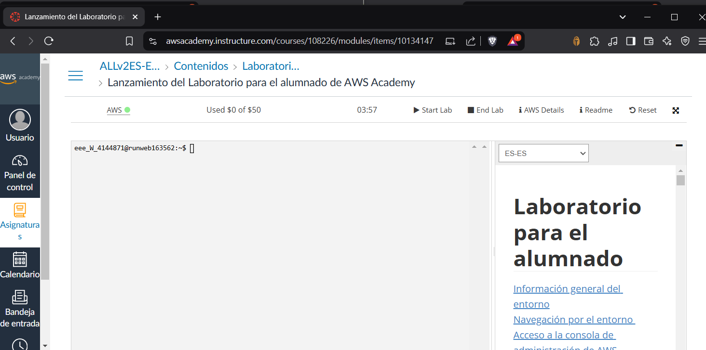

# Práctica 3.1: Implementación de una VPC y despliegue de instancias EC2 con Apache y PHP

En esta práctica, se creará una VPC personalizada y se desplegarán instancias EC2 que ejecuten Apache y PHP en AWS.

## Índice

- [1. Creación de una VPC](#1-creación-de-una-vpc)
- [2. Lanzamiento de instancias EC2](#2-lanzamiento-de-instancias-ec2)
- [3. Instalación de Apache y PHP](#3-instalación-de-apache-y-php)
- [4. Configuración del balanceador de carga](#4-configuración-del-balanceador-de-carga)
- [5. Pruebas de funcionamiento](#5-pruebas-de-funcionamiento)
- [6. Limpieza de recursos](#6-limpieza-de-recursos)

---

## 1. Creación de una VPC
1. Acceder a la consola de AWS:  
1.1. Iniciar el laboratorio:

2. Navegar al servicio **VPC**.
3. Crear una nueva VPC:
    - **Nombre**: `mi-vpc`
    - **CIDR**: `10.2.0.0/16`
