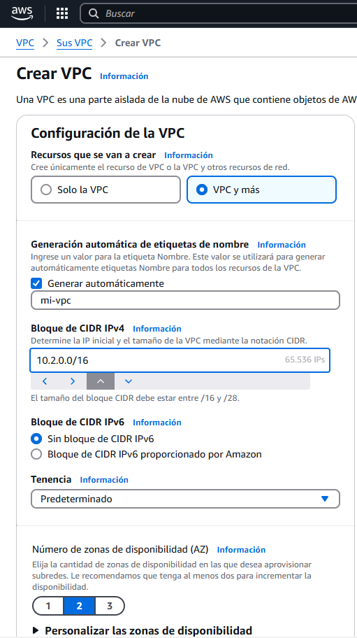
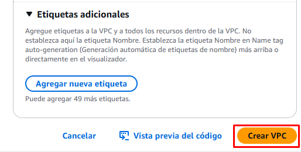
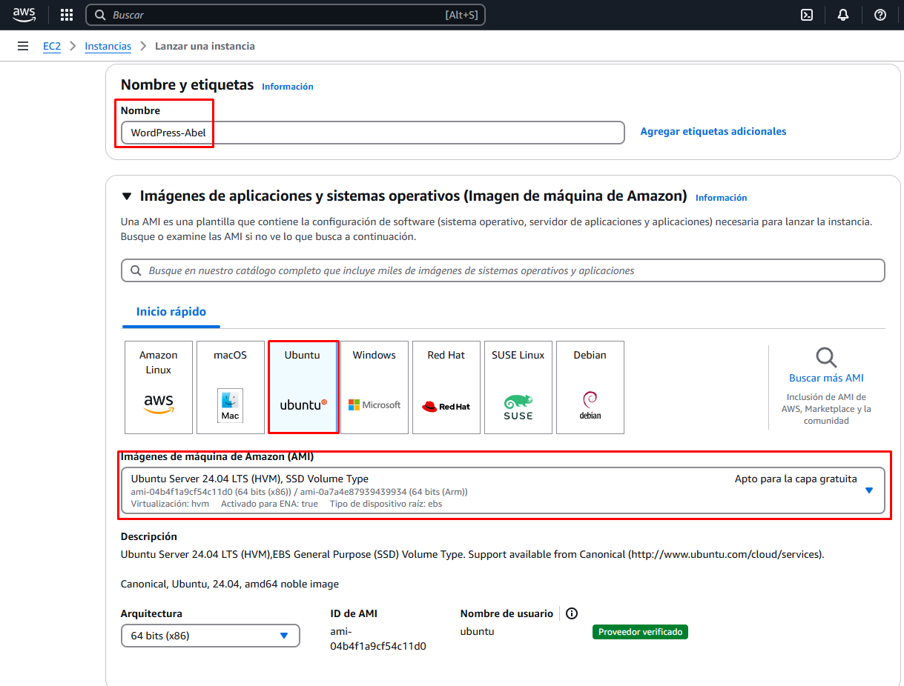
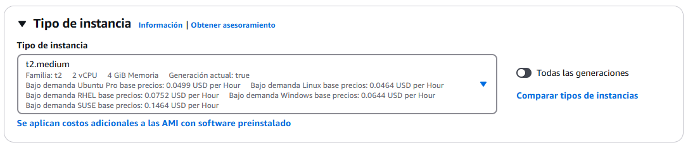
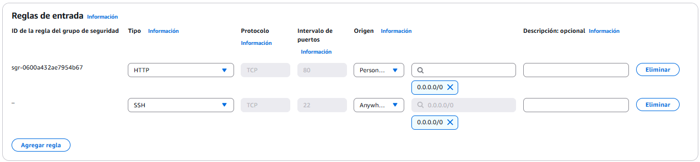

# Práctica 3.1: Implementación de una VPC y despliegue de instancias EC2 con Apache y PHP

En esta práctica, se creará una VPC personalizada y se desplegarán instancias EC2 que ejecuten Apache y PHP en AWS.

## Índice

- [1. Creación de una VPC](#1-creación-de-una-vpc)
- [2. Lanzamiento de instancias EC2](#2-lanzamiento-de-instancias-ec2)
- [3. Instalación de Apache y PHP](#3-instalación-de-apache-y-php)
- [4. Configuración del balanceador de carga](#4-configuración-del-balanceador-de-carga)
- [5. Pruebas de funcionamiento](#5-pruebas-de-funcionamiento)
- [6. Limpieza de recursos](#6-limpieza-de-recursos)

---

## 1. Creación de una VPC
1. Acceder a la consola de AWS: <br>
1.1. Iniciar el laboratorio:
 <br>
2. Navegar al servicio **VPC**. <br>
3. Crear una nueva VPC:
    - **Nombre**: `mi-vpc`
    - **CIDR**: `10.2.0.0/16` <br>
 <br>
4. Crearemos la VPC:
 <br>

---

## 2. Lanzamiento de instancias EC2

1. Navegar al servicio **EC2**.
2. Lanzar una nueva instancia EC2:
    - **Nombre**: `WordPress-Abel`
    - **AMI**: Ubuntu Server 20.04 LTS
    - **Tipo de instancia**: `t2.medium`
    - **Par de claves**: Selecciona `vockey`
3. Configuraciones de red:
    - **VPC**: `mi-vpc`
    - **Subred**: `subred-publica`
 <br>
 <br>
4. Configurar **Grupo de Seguridad**:
    - Permitir **SSH (22)** desde tu IP
    - Permitir **HTTP (80)** desde cualquier IP
 <br>
5. Lanzar la instancia. <br>

---

## 3. Instalación de Apache y PHP

1. Conéctate por SSH a la instancia:
2. Actualizar paquetes:

    ```bash
    sudo apt update && sudo apt upgrade -y
    ```

