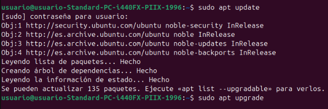
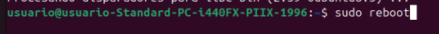
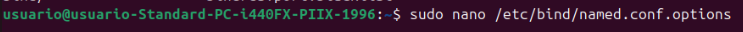
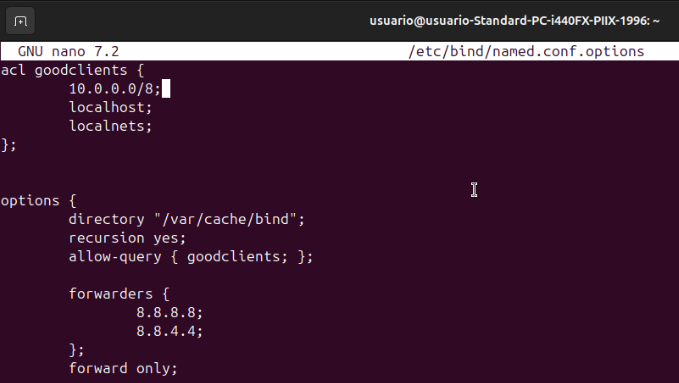
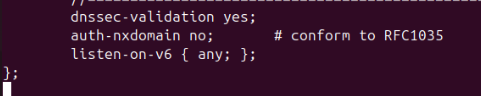
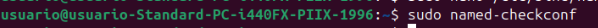
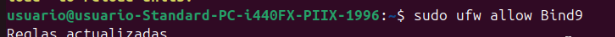
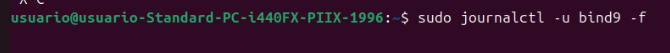
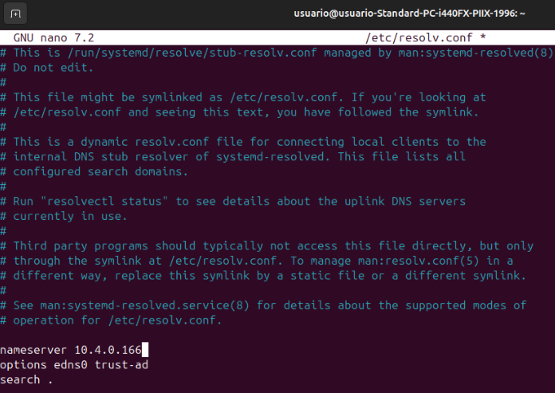
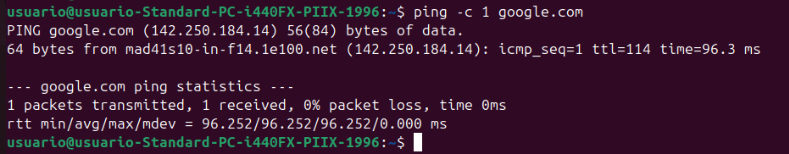

# Instalación del servidor DNS Bind como Caché y Reenviador

En esta práctica, aprenderemos a instalar y configurar el servidor DNS **Bind9** para que funcione como un servidor de caché y reenviador en un sistema basado en **Ubuntu**.

## Paso 1: Actualización del sistema

Antes de comenzar con la instalación, es fundamental asegurarse de que el sistema esté actualizado. Para ello, ejecuta los siguientes comandos:  
  

Después de la actualización, es recomendable reiniciar el sistema:  
  

## Paso 2: Instalación de Bind9

Una vez que el sistema esté actualizado y reiniciado, procedemos a instalar **Bind9** junto con sus utilidades y documentación:  
  

## Paso 3: Configuración de Bind9

Después de la instalación, es necesario configurar Bind9 para que funcione como un servidor de caché y reenviador. Edita el archivo de opciones de configuración:  
  

Dentro de este archivo, agrega la siguiente configuración:  
  
  

### Explicación de la configuración:

- **ACL (Access Control List)** `goodclients`: Define las redes y hosts que tienen permitido realizar consultas al servidor DNS. Debes reemplazar `RED Y MÁSCARA` por la red y máscara de tu entorno.
- **`forwarders`**: Especifica las direcciones IP de los servidores DNS a los que se reenviarán las consultas que el servidor no pueda resolver por sí mismo. En este caso, se utilizan los servidores DNS públicos de Google (**8.8.8.8** y **8.8.4.4**).

## Paso 4: Verificación de la configuración

Antes de reiniciar el servicio, es importante verificar que la configuración no contenga errores:  
  

Si el comando no devuelve ningún mensaje, significa que la configuración es correcta.

## Paso 5: Reinicio del servicio Bind9

Para aplicar los cambios realizados, reinicia el servicio Bind9:  
  

## Paso 6: Permitir el servicio en el firewall

Si el firewall está habilitado en tu sistema, debes permitir el tráfico DNS:  
  
  

## Paso 7: Configurar los clientes para usar el servidor DNS

Para que los clientes puedan usar el servidor DNS recién configurado, es necesario cambiar la configuración de red en cada cliente.
Edita el archivo de configuración de red en el cliente y cambia el servidor DNS al que acabamos de configurar:  

Agrega la siguiente línea, reemplazando `IP_DEL_SERVIDOR_DNS` por la dirección IP del servidor DNS:  
  

Guarda los cambios y cierra el archivo.

## Paso 8: Comprobación del funcionamiento

Para verificar que el servidor DNS funciona correctamente, podemos realizar una consulta de prueba usando el comando `nslookup` o `dig` desde un cliente configurado:  
  

Si el servidor DNS está funcionando correctamente, debería resolver el nombre de dominio y mostrar la dirección IP correspondiente.

## Conclusión

Con estos pasos, hemos instalado y configurado correctamente el servidor **DNS Bind9** como un servidor de caché y reenviador. Esto permite mejorar el rendimiento de la resolución de nombres en una red y optimizar la carga de las consultas DNS.

**Nota**: Es importante asegurarse de que las direcciones IP y las configuraciones específicas se ajusten a las necesidades y al entorno de red de tu organización.
